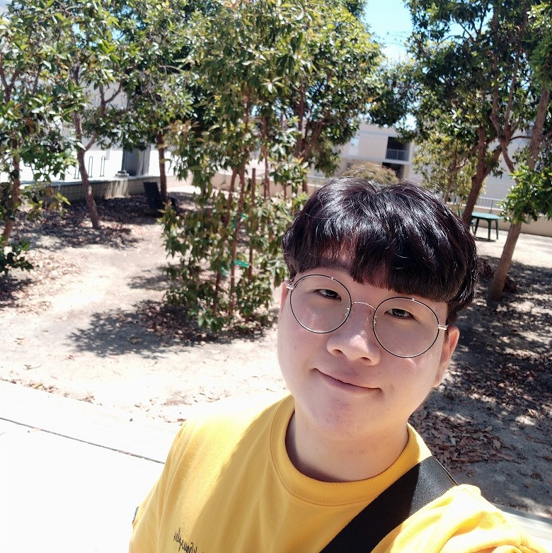

> 본 문서는 Notion을 기반으로 만들어진 문서입니다.
> 원본으로 보고싶으신 분들은 [Notion 이력서](https://www.notion.so/About-dding-g-776f9cfa976147db9befff2dc15249ee) 를 참고해주세요.

# About dding-g 

# 🤔 조명근(dding-g)이 누구?

> 안녕하세요! 풀스택 개발자를 꿈꾸는 조명근입니다. 
> 저는 새로운 기술들을 사용해 보는걸 좋아하고, 
> 혼자 프로젝트를 진행하는 것 보다 여러 사람들과 함께 프로젝트를 진행하는걸 좋아합니다. 
> 사람들과 어울리는걸 좋아하고 
> *"시도하지 않으면 실패조차 없다."* 
> 실패해도 배움이 있다는 자세로 끊임없이 도전하고 있습니다. 
> 최근에는 공부한 내용들을 블로그에 쌓아가고 있습니다.

🕹 Github : [https://github.com/dding-g](https://github.com/dding-g)

🖊 Blog : [http://ddingg.tistory.com/](http://ddingg.tistory.com/)

✉ Email : area409@naver.com

---

**순서**

1. 수상 경력
2. 자격증
3. 기술 Stack
4. 진행한 프로젝트
5. 대외 활동
6. Education
7. Carrer

---

## 🏆 수상 경력

- 2019.08 미국 UCSD Health-Related IoT Project 1등팀

  - [2019 QI IoT Summer Project 후기](https://ddingg.tistory.com/24?category=845598)

- 2019.09 강원도 아이디어 해커톤 대상

  - [2019 강원 아이디어 해커톤 Github](https://github.com/dding-g/2019_Gangwon_IDEA_SW_HACKATHON)

- 2019.10 SW캡스톤디자인 결과발표회 은상

  - [Tesseract_Korean_Converter Github](https://github.com/dding-g/Tesseract_Korean_Converter)

- 2019.12 강원 ICT 경진대회 장려상 (강원대학교 SW사업단장 상)

---

## 📄 자격증

- AWS Solutions Architect - Associate

---

## 📌 Stack

[기술 스택](https://www.notion.so/5be55ebdd8ef4a40aba0ea53e18fb1c8)

---

## ⛷ 진행한 프로젝트

### 📋 PHAS (2020.04 ~ 진행중)

- 한줄 소개 : 강아지 심박음을 측정 및 녹음하여 "이첨판 폐쇄부전증" 을 측정하기 위한 시스템 개발
- 프로젝트 인원 : Android 2, Back-end 2
- 맡은 파트 : Back-end 개발 총괄
- 사용 기술 : Python, django, Docker, Postgresql, Github
- 특이 사항
  - 교내 창업 동아리 진행
  - 교내 1학기 캡스톤 디자인 경연 대회 2위
  - 교육부, 과학기술정보통신부 주최 : 창업 300 창업 도전형 450팀 이내 선발

- 개발 부분
  - 회원가입, 로그인, 심박음 저장 및 조회 API 구현
  - Docker를 활용해 DB와 Server가 독립적인 컨테이너에서 동작하도록 구현
  - Travis-CI 를 연동하여 테스트 자동화 
  - NoiseReducer 를 사용하여 심음 파일의 잡음 제거

- Github

  - [2020-Hallym-Capstone-Design-Team-PHAS](https://github.com/2020-Hallym-Capstone-Design-Team-PHAS)

### 📋 Temporage (2020.01 ~ 2020.02)

- 한줄 소개 : 내가 메모한걸 볼 수 있고 유용한 내용은 공유 할 수 있는 서비스
- 프로젝트 인원 : Front-end 1, Back-end 1
- 맡은 파트 : Beck-end 개발
- 사용 기술 : Java, SpringBoot, Postgresql, Github
- 개발 부분

  - JPA를 활용하여 개발
  - 게시글 공유 기능 개발
  - 게시글 작성 및 카테고리 추가 기능 개발
  - 회원가입 및 로그인 기능 개발
  - Database 설계에 참여
  - Jenkins, Github를 활용해 AWS EC2에 배포

- Github

  - [haneunjung/temporage-back](https://github.com/haneunjung/temporage-back)

### 📋 미국 UCSD Health-Related IoT Project (2019.07 ~ 2019.08)

- 한줄 소개 : 임산부를 위한 대기 오염도, 심박수를 측정하고 실시간 차트와 log를 볼 수 있는 서비스
- 프로젝트 인원 : Hardware 1, Android2, Web 1
- 맡은 파트 : Front-end, Back-end 개발
- 사용 기술 : PHP, Slim, MySQL, HTML, CSS, JQuery, Javascript, GoogleMap API, Github
- 특이사항
  - 전체 5개 팀 중 1등 수료
- 개발 부분

  - System Architecture, Procedure, Flow Chart, Data Structure 들을 설계 및 발표
  - Google Map API를 활용하여 센서에서 측정한 대기오염도를 DB에 저장 및 Display
  - 로그인 및 회원 가입(Email로 verification) API 개발. 
  - 회원 탈퇴 및 비밀번호 변경 API 개발
  - 센서에서 측정한 대기 오염도 데이터를 저장/조회 할 수 있는 API 개발.
  - 안드로이드 GPS 데이터 실시간 저장 및 조회 API 개발.
  - 안드로이드에서 측정한 심박수 데이터 실시간 저장 및 조회 API 개발
  - Google Map API, Google Chart, AM Chart, Apex Chart를 이용하여 데이터들을 Display
  - 웹 Front-end 화면 모두 구현 (사진 Github 참고)

- Github

  - [dding-g/Project_UCSD](https://github.com/dding-g/Project_UCSD)

---

## 💎 대외 활동

### ✏ 학술동아리 C.愛.랑의 회장 및 오픈소스 교육

저는 18년 11월부터 19년 11월까지 100명 규모의 동아리 회장을 맡았습니다.
회장을 맡으면서 사람들과 함께 협업하고 일을 분배해서 처리하는 것이 얼마나 중요한지 경험하였습니다.
또 많은 사람들의 의견을 하나로 통합하는건 정말 어려운 일이고 
그럴때는 회장과 같은 중심을 잡아줄 사람이 꼭 필요하다고 느꼈습니다.
어떤 조직을 이끌어 가기 위해서는 구체적이고 상세한 계획의 수립과 일의 진행 상황, 적절한 일의 분담은 
조직이 마찰 없이 나아갈 수 있는지를 결정하는아주 큰 부분이라고 느꼈습니다.

이 부분은 프로젝트를 진행하는데도 예외는 아닙니다.
프로젝트를 얼마나 잘 설계하는지는 프로젝트의 진행 속도를 좌지우지할 만큼 중요한 요소입니다.
또 진행 상황을 체크해 어떤 부분이 막히는지 등을 피드백하여 빠르게 고쳐나갈 수 있으며 
기능 구현에 대한 분업을 통해 빠르게 필요한 부분을 만들어 갈수 있습니다.
저는 이런 프로젝트를 "2019 UCSD QI Summer IoT Camp"를 통해 경험하였으며 
5개 팀 중 1등이라는 결과를 만들었습니다.

씨애랑 동아리 에서는 매년 여름방학에 워크숍을 개최하고 있습니다.
6주간 안드로이드, 임베디드, 게임 개발 등 관심 있는 분야를 선택해 신입 부원에게 멘토링을 진행합니다.
이런 배경을 바탕으로 11월 교내에 SW 전시회를 개최하여 
1년 동안 만든 SW작품들을 전시하는 행사를 동아리 자체적으로 개최하였습니다.
이런 행사는 코딩에 대한 즐거움과 자신이 어떤 분야를 흥미있어 하는지를 알게 되는 등 
많은 긍정적인 반응을 보였습니다.
하지만 여전히 코딩을 어려워 하는 친구들이 많았습니다.
그래서 저는 신입생들이 어떻게 하면 첫 시작을 재미있게 할 수 있을까 에 대한 고민을 하게 되었습니다.
과거 경험들을 제 경험들을 바탕으로 생각했을때 
저는 코딩이 어려운 부분보다새로운걸 해야한다는 강박감에 시달렸던것 같습니다.
그래서 저는 동아리 부원들에게 오픈소스 의 적극적인 사용을 장려하였습니다.
오픈소스가 어떤 것인가에 대한 소개부터 시작하여 
저작권에 대한 주의사항, 사용법 등의 교육을 매 년 2회 실시하도록 체계를 만들었습니다.
11월 SW전시회때는 작품 소개서에 프로젝트 Github 주소의 QR코드를 붙여 
어떤 오픈소스를 사용했는지에 대한 것들도 명시하도록 하였습니다.
어떤 일을 시작하게 되면 그 일이 어떤 점에서 중요한지 부터 파악하면서 시작하게 됩니다.
그래야 왜 이 일을 하고 있는지 알 수 있고 그 일에 대한 열정과 책임감이 생기게 됩니다.

왜 오픈소스가 중요하고 유용한지 알아야 사용률도 높아질 거라 생각합니다.
오픈소스가 가져오는 파급력은 점점 커지고 있습니다. 
제가 시작한 작은 발걸음이 후배들에게 도움이 되었으면 좋겠습니다.

---

## 🧑‍🎓Education

- 한림대학교 SW융합대학 빅데이터 전공 (2015.02 ~ 2021.03 졸업 예정)
- QI UCSD Health-Related IoT Tracking platform 과정 수료 (미국)

---
## 📔Career

- (주) 구름 (인턴)(엔지니어)
    - 기간 : 2020.09.01 ~ 현재
    - 직무 : 구름IDE 기능 개발 및 유지 보수
    - Node.js, React, MongoDB 를 사용한 Full-Stack 개발
